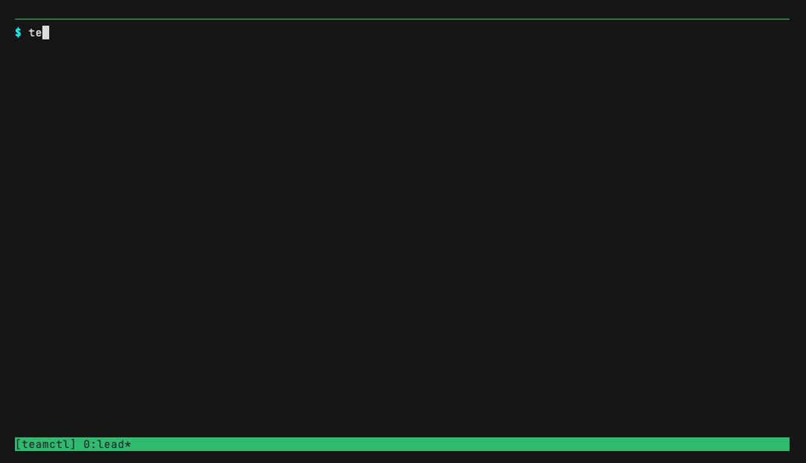

# teamctl

> **Your AI subscriptions, working as one team.**

You're paying for Claude Code. Maybe Codex. Maybe Grok, maybe Gemini. Each
one sits in its own terminal, each with its own usage meter, and *you* are
the integration layer. **teamctl** fixes that: it turns a tmux window into
an AI agent team — a *lead* (you, or a lead agent) in the left pane, and
*teammates* — Claude Code, Codex, Grok, or Gemini CLI sessions, or any CLI
you teach it — tiled as labeled panes to the right — **and routes the
team's work to whichever subscription has budget right now.** That
combination is the point: plenty of tools scrape a quota or tile agents in
tmux; as far as we can tell teamctl is the first **quota-aware router for
subscription-CLI agent teams** — orchestration that reads your real usage
meters and steers each dispatch to live capacity. It drives the **official
vendor CLIs** under your own logins — nothing is impersonated, proxied, or
reverse-engineered about your subscription access. Single-file Python,
stdlib only.

<!-- HERO GIF SLOT — the money shot. One real task fanned across three
     providers: research → grok, implementation → claude, review → codex,
     three panes visibly working at once, results read back as JSON, FULL
     three-teammate teardown on camera. Produced per
     docs/recordings/demo-storyboard.md; swap src to docs/assets/demo-v2.gif
     when rendered. Until then the previous demo holds the slot. -->


```sh
curl -fsSL https://raw.githubusercontent.com/ryderderder/teamctl/main/install.sh | bash
```

One line. The installer copies `teamctl` to `~/.local/bin`, offers to
install anything missing (always asking first), then drops you into a tmux
session where the zero-question express setup has already run — providers
detected, sane defaults written, done in seconds.

[](https://github.com/ryderderder/teamctl/actions/workflows/ci.yml)
[](https://github.com/ryderderder/teamctl/releases)
[](LICENSE)

## Sixty seconds to a working teammate

Copy-paste, top to bottom. Ends with a real agent visibly working in a
pane beside you:

```sh
# 1. install — the one-liner above; it lands you inside tmux, configured (~20s)

# 2. your first teammate: a real provider session opens in a labeled pane,
#    seeded with your prompt (uses your configured/first-detected provider)
teamctl spawn scout --prompt "Read this directory and tell me what it does."

# 3. it's a real pane — watch it, steer it
teamctl list
teamctl send scout "Summarize your findings in 3 bullets."

# 4. clean teardown: process tree killed, verified, pane closed
teamctl shutdown scout
```

That's the whole mental model: roles in panes, commands from the lead.
Everything else (headless dispatch, JSON results, routing, worktrees) is
the same shape with more leverage — see the [use cases](#use-cases) below
and the [recipes page](docs/use-cases.md).

---

## Why this exists

- **You already pay for more than one AI.** teamctl makes the subscriptions
  additive: one task force drawing on every CLI you're signed into, instead
  of four separate chat windows and a lot of copy-paste.
- **Capacity is real and it moves.** `teamctl usage` shows real usage
  percentages and reset times where providers expose them; `teamctl route`
  sends work to the usable provider with the **most quota left** — so a
  rate-limited Monday afternoon doesn't stall your work.
- **Delegation needs plumbing, not vibes.** `dispatch` hands a teammate a
  task headlessly in a watchable pane; the result lands as JSON in a handoff
  directory; `result --wait` blocks until it's done and fails fast if the
  teammate dies. `followup` continues the *exact same provider session* —
  never a guess at "most recent".
- **Parallel writers need walls.** Every teammate gets its own git worktree
  (its own branch, its own directory — collisions are physically
  impossible), and `teamctl land` merges the work back when you've reviewed
  it. Nothing is ever silently discarded.
- **Teams need teardown — and mornings-after.** `shutdown` kills the whole
  process tree, verifies it, and closes the pane; no orphaned agents
  pinging away at 3am. And after a reboot, `teamctl resurrect` rebuilds
  the roster instead of forgetting it.
- **It's honest about what it can't know.** Usage numbers exist only where
  providers expose them; teamctl labels stale data and says "unknown"
  rather than inventing numbers. (See [Limitations](#limitations-honest-ones).)

## What it looks like

Every teammate is a real tmux pane with a sticky border label — `role ·
model` — that the provider CLI can't overwrite. The lead pane keeps its
width; teammates tile as a square-ish grid beside it. You can watch every
teammate think, type into any of them, or ignore them until `result --wait`
returns.

## What's new in v0.5.0

**More providers, safer parallelism, smarter routing** — and two behavior
changes worth knowing before you upgrade:

1. **Routing picks by headroom now.** Usable providers are ranked by
   remaining quota; your preference order breaks ties. Nothing previously
   excluded can ever be selected — only the order among survivors changes.
   The old strict-order behavior is one line away:
   `teamctl config routing.strategy preference`.
2. **Worktree isolation is ON by default** in git repos (see
   [Worktrees & landing](#worktrees--landing-parallel-writers-that-cannot-collide)).
   Opt out per launch with `--no-worktree` or globally with
   `teamctl config worktree.enabled false`. Disk note: a worktree is a
   full checkout of *tracked* files; untracked artifacts (node_modules,
   venvs, build dirs) are per-worktree by design.

Also new: **Gemini CLI as a first-class provider** (with two honest
caveats — no local usage feed, and upstream resume flake #24808, both
detailed below), **bring-your-own-CLI** via `[providers.custom.*]`,
`teamctl status` (busy / needs-input / idle + a `[notify]` hook),
`teamctl land` / `worktree list|prune`, `teamctl resurrect`, a doctor
`environment` row (WSL awareness), and `--json` on every new surface.

---

## Use cases

### Accelerating research — parallel researchers across providers

Fan a question out to independent researchers on *different* providers and
triangulate. Model diversity is a feature: three models make three different
mistakes, and disagreement is signal — anything all three agree on you can
trust; anything they split on gets a follow-up. It's also cheap concurrency:
three subscriptions, three meters, one wall-clock wait instead of three.

```sh
# Three independent takes on the same question, one per subscription.
teamctl dispatch researcher-a --provider claude \
    --task "Survey how mature CLIs shape --json output (gh, docker, jq). Recommend a schema for ours. Return JSON: {shape, rationale}."
teamctl dispatch researcher-b --provider codex \
    --task "Same question, independently: recommend a --json output schema for a log-filtering CLI. Return JSON: {shape, rationale}."
teamctl dispatch researcher-c --provider grok \
    --task "Same question, independently. Return JSON: {shape, rationale}."

teamctl result researcher-a --wait   # each result is parseable JSON
teamctl result researcher-b --wait
teamctl result researcher-c --wait

# Disagreement found? Continue the exact same session — no context lost.
teamctl followup researcher-b --task "researcher-a proposed X instead. Steelman theirs, then pick one."
```

Each pane streams the researcher's work live; each `result` is machine-
readable, so a lead agent can synthesize the three answers automatically.

### Accelerating coding — builder/reviewer separation, competing implementations

The oldest quality trick in software — the person who wrote it doesn't
review it — works for agents too, and works *better* when the reviewer is a
different model from a different vendor with different blind spots. And in
a git repo the builder automatically works in **its own worktree**, so its
writes can't touch your tree until you land them.

```sh
# One writes, a different provider reviews. One owner per file, always —
# and the worktree makes that mechanical, not just polite.
teamctl spawn builder --provider claude \
    --prompt "Implement the --json flag per docs/plan.md. You own tinylog.py."
# ...builder works on branch teamctl/builder in its own directory; then:
teamctl dispatch reviewer --provider codex \
    --task "Review the diff on branch teamctl/builder for correctness and edge cases. Return JSON: {verdicts: [{file, line, issue, severity}]}."
teamctl result reviewer --wait

# Review is clean? Merge the builder's branch back and clean up:
teamctl land builder --dry-run     # diffstat + counts first
teamctl land builder

# Or: competing implementations, then judge.
teamctl dispatch impl-a --provider claude --task "Implement quota tracking per SPEC.md. Print a unified diff." --cwd ~/work/copy-a
teamctl dispatch impl-b --provider codex  --task "Implement quota tracking per SPEC.md. Print a unified diff." --cwd ~/work/copy-b
teamctl result impl-a --wait; teamctl result impl-b --wait
teamctl dispatch judge --provider grok \
    --task "Two diffs for the same spec are in a.diff and b.diff. Score both for correctness and simplicity; pick a winner. Return JSON."
```

`spawn` gives you a live interactive session you can steer mid-flight
(`teamctl send builder "Focus on the error handling in server.py."`);
`dispatch` is fire-and-collect. Both get a labeled pane you can watch.

### Accelerating agentic ops — long-running dispatch, usage-aware routing

For standing pipelines — nightly audits, doc sweeps, migration batches — the
question isn't "which model is smartest", it's "which subscription has
headroom *right now*". teamctl answers from live data:

```sh
teamctl usage
# PROVIDER  USAGE
# claude    5h: 44% used, resets 3:00 PM
# codex     5h: 0% used, resets 1:39 AM (now)
# codex     weekly: 73% used, resets 12:41 AM (in 142h13m)
# grok      weekly: 18% used (probe)
# gemini    quiet — gemini exposes no local usage feed — it stays quiet

# route sends the job to the usable provider with the most quota left
# (your preference order breaks ties; anything not installed, not signed
# in, or known-exhausted is excluded first). --dry-run shows every number
# the choice used — unknowns as ?%, stale probe data flagged.
teamctl route auditor --task "Audit this repo's TODOs; rank by effort. JSON." --dry-run
# route: selected grok (headroom: grok 18% used < claude 44% < codex 73% ·
#   preference tiebreak claude>codex>grok>gemini; skipped …)

teamctl route auditor --task "Audit this repo's TODOs; rank by effort. JSON."
teamctl result auditor --wait --timeout 1800     # long jobs: raise the cap

# A dispatched pane closes itself when the task finishes; the teammate stays
# tracked as `done`, `result` keeps working indefinitely, and `followup`
# reopens the same provider session for the next batch.
teamctl followup auditor --task "Now do the same for FIXMEs."
```

Exhaustion signals auto-expire at the provider's reset time, so routing
self-heals as quotas refill. Match spend to difficulty per task with
`--model`/`--effort` — light models for mechanical sweeps, heavyweight for
hard reasoning.

### A lead *agent* runs all of the above for you

Everything shown is plain CLI, which means an AI agent can drive it.
`teamctl lead on` installs a manager identity into every detected agent
CLI's global instructions: check `usage`/`providers` before committing,
delegate non-trivial work, one owner per file, zero idle teammates, shut
down what's done. Then you just talk to your lead:

> "Add rate limiting to the API server. Use the team."

…and the lead checks capacity, casts the roles, dispatches, synthesizes,
lands the work, and cleans up — the demo GIF above is exactly this loop.
See [Lead mode](#lead-mode).

---

## How it compares

|  | juggling CLIs by hand | Claude Code agent teams (native) | **teamctl** |
|---|---|---|---|
| Providers | all of them, in N windows | Claude only | Claude, Codex, Grok, Gemini — equal footing, plus bring-your-own via config |
| Who integrates results | you, by copy-paste | the lead agent | the lead agent (any provider) |
| Quota awareness | you, by vibes | — | real usage %/reset times; routing sends work to the most headroom, skips exhausted providers, signals auto-expire |
| Parallel write safety | you, by discipline | in-session | a git worktree per teammate + `teamctl land` — collisions physically impossible, work always reconciled back |
| Teammate visibility | N terminals | in-session | labeled tmux panes (`role · model`), watchable + steerable, busy/blocked/idle detection |
| Machine-readable handoff | no | in-session | `dispatch` → `result --wait` JSON contract, exact-session `followup` |
| Teardown & recovery | you remember | in-session | `shutdown`: process-tree-verified, no orphans; `resurrect`: the roster survives reboots |

Three lines on the neighbors, since you'll ask: **claude-squad** manages
multiple agent sessions in tmux — teamctl's center of gravity is
different: a lead *delegating* through a task/result protocol with
quota-aware routing across subscriptions. **Tmux-Orchestrator** automates
Claude-driven tmux workflows — teamctl is provider-neutral plumbing with
real usage tracking and verified teardown. **Claude Code's native agent
teams** directly inspired teamctl (see [Credits](#credits)) and remain
the deepest Claude-native experience; teamctl reimagines the shape on
plain tmux so any provider's CLI can play — and because teammates are
ordinary tmux panes, they survive the lead's exit. After a crash or
reboot, `teamctl resurrect` rebuilds the roster from what teamctl
recorded — native teams, as of this writing, can't resume teammates
after one.

## Install

**Tell your agent to install it — paste this** into any AI coding CLI
(also in [docs/INSTALL_PROMPT.md](docs/INSTALL_PROMPT.md)):

```text
Install teamctl for me from this repo:
https://github.com/ryderderder/teamctl
(private for now — ask me for auth, don't guess credentials)
Read README.md, docs/AGENT_GUIDE.md, and llms.txt from
the repo, then install and verify it yourself (use
install.sh; check with teamctl doctor).
Ask me before anything that needs sudo.
```

Or run the one-liner yourself:

```sh
curl -fsSL https://raw.githubusercontent.com/ryderderder/teamctl/main/install.sh | bash
```

<!-- INSTALL GIF SLOT — cold machine → one-liner → dependency detection →
     the twelve-line dark room → landed in tmux. Produced per
     docs/recordings/install-storyboard.md; uncomment when rendered:

-->

The installer detects missing dependencies and **offers** to install them
(tmux — a hard requirement — defaults to yes; nothing is ever installed
without asking), prints official install one-liners for any provider CLI
you don't have (never auto-installs them), then drops you into tmux where
`teamctl init` — the zero-question express setup — has already run.

Options: `--custom-init` (the rich arrow-key wizard instead of express),
`--no-init` (skip the setup/tmux bootstrap), `--no-deps` (skip dependency
offers). Safe to re-run. From a checkout:
`git clone https://github.com/ryderderder/teamctl && cd teamctl && ./install.sh`.

## Updating

```sh
teamctl update --check     # installed vs latest, from your install source
teamctl update             # replace ~/.local/bin/teamctl
```

The installer records where teamctl came from (`install-meta.json` in the
state dir: a git clone, the curl one-liner, or a plain local copy).
`update` re-fetches from that source and atomically replaces the
installed copies: git checkouts fetch and read the files out of
`FETCH_HEAD` (your checkout is never moved or dirtied), private repos go
through an authenticated `gh`, public installs through curl. Your config
(`~/.config/agent-team/`) and state are never touched. An unreachable
source prints the reason per route — never a stack trace — and a download
that doesn't compile is refused.

teamctl also runs a **background version check** at most once a day
(fully detached, silent on any failure, never blocking a command). When a
newer version is known, one dim line appears at session start and under
`providers`/`usage`:

    · teamctl X.Y.Z available — teamctl update

Tune it in the config under `[update]`: `check = true|false` and
`mode = "prompt" | "auto" | "off"` — `auto` applies a known-newer version
at session start (an explicit opt-in; never the default), `off` never
mentions updates. Installs made before v0.4.0 have no recorded source:
re-run `install.sh` once and `teamctl update` works from then on.

## Health check

```sh
teamctl doctor
```

A one-shot environment check in the dark-room style — a `ok` / `warn` /
`fail` row per concern: the environment itself (WSL is recognized and
greeted as supported, with a browser-sign-in interop note), python
version, tmux (presence + version quirks), the
[provider states](#provider-states), config parse + schema sanity, the
Claude Code statusline wiring, whether the install-source metadata is
recorded (so `teamctl update` works), a writable state dir, orphaned
worktrees, and crash-lost teammates waiting for `teamctl resurrect`. The
exit code reflects the worst finding (`0` ok · `1` warn · `2` fail), so
it drops into CI or a pre-flight script.

## Provider states

Every surface that names a provider — `teamctl providers`, `teamctl
usage`, the init frames, the installer's detection screen — speaks the
same word lattice, so different truths never share one ambiguous label:

| state | meaning | what to do |
|---|---|---|
| `ready` | installed, signed in, usage numbers known (shown inline) | nothing — spawn away |
| `quiet` | installed and signed in; no usage numbers seen yet | nothing — it wakes on first use (each surface shows the exact wake hint) |
| `locked out` | installed but not signed in | the CLI's own login: `claude auth login` / `codex login` / `grok login` / gemini's in-TUI `/auth` |
| `not installed` | CLI not on PATH | the installer prints the official install one-liners |
| `unknown` | auth artifacts exist but can't be read | reported honestly instead of guessing — check the CLI |

`quiet` and `ready` providers are equally usable for spawning and
routing — usage data changes the word, not the eligibility. (Gemini is
the permanent-`quiet` case: it exposes no local usage feed at all, and
teamctl says so instead of inventing numbers.) A custom provider with no
auth configuration shows `quiet — auth not probed` and stays routable.
Residual usage artifacts left by an *uninstalled* CLI (e.g. leftover
`~/.codex/sessions` rollouts) are flagged as `not installed — residual
usage history found` and never rendered as a live provider.

## Requirements

| platform | status |
| --- | --- |
| macOS | supported — developed and verified here |
| Linux | supported — verified by CI (ubuntu-latest, live tmux pane tests) |
| WSL | runs as Linux — the installer greets it as supported and `doctor` reports the environment (with a note about browser sign-ins through Windows interop). Detection is tested; WSL itself has not been separately field-verified. |
| Windows | native: **not supported** (tmux doesn't run there). Use WSL — the installer detects native Windows and prints the WSL steps. |

- [tmux](https://github.com/tmux/tmux) (teamctl runs inside a tmux session)
- Python 3.11+ (3.9+ works, but config-file support needs `tomllib` from 3.11)
- git, only if you use worktree isolation (on by default *in a git repo*;
  everything else works without git)
- At least one provider CLI installed and logged in:
  [Claude Code](https://code.claude.com) (`claude`), OpenAI Codex CLI
  (`codex`), Grok CLI (`grok`), or
  [Gemini CLI](https://geminicli.com) (`gemini`) — or your own via
  [`[providers.custom.*]`](#custom-providers-bring-your-own-cli)

The installer detects missing tmux/python3 and **offers** to install them via
your package manager (brew / apt-get / dnf / pacman) — it always asks first
(tmux defaults to yes, everything else to no), tells you when a command will
use sudo, and `--no-deps` skips the offers entirely. Provider CLIs are never
auto-installed; their official install one-liners are printed instead.

## The front door

```sh
teamctl        # ← just this
```

Type `teamctl` on its own in a terminal and you're in: it opens your
default chat provider as the **lead** — in the `teamctl` tmux session, with
lead mode enabled — the full team-lead experience in one word. The default
provider/model/effort come from your config (`[lead] chat_provider` /
`chat_model` / `chat_effort`, falling back to your routing preference or
the only signed-in provider); set them in `teamctl settings`. If nothing's
signed in, or the chosen provider is locked out, it says so and names the
fix — never a stack trace. Piped or in CI (no terminal), bare `teamctl`
prints usage as before. And if a reboot took your roster with it, the
front door says so and offers `teamctl resurrect`.

## Quickstart

```sh
# Interactive teammate: opens a provider CLI pane seeded with a prompt.
teamctl spawn reviewer --provider codex \
    --prompt "Review the diff on this branch for correctness."

# See who's active — and who's busy, blocked on an approval, or idle.
teamctl list
teamctl status            # busy / needs-input / idle (--watch to poll)

# Type a follow-up instruction into a running teammate's pane.
teamctl send reviewer "Focus on the error handling in server.py."

# Headless task: runs in a watchable pane, result lands in a handoff dir.
teamctl dispatch researcher --provider grok \
    --task "Summarize the TODOs in this repo as JSON." --cwd ~/myproject

# Read the result back (blocks until done; fails fast if the teammate dies).
teamctl result researcher --wait

# Another turn in the exact same provider session.
teamctl followup researcher --task "Now rank them by effort."

# No --provider? Your configured routing order decides (or the only
# detected provider). With several providers and no configured order,
# teamctl asks rather than silently picking one for you.
teamctl spawn helper --prompt "Draft release notes from the last 10 commits."

# Or let route pick: the usable provider with the most quota left
# (your configured order breaks ties; anything not installed, not
# logged in, or known-exhausted is excluded first).
teamctl route helper --task "Draft release notes from the last 10 commits."
teamctl route helper --task "..." --dry-run     # preview: every % it used

# Provider availability, real usage, and current model lists.
teamctl providers
teamctl usage
teamctl models

# A writing teammate worked in its own worktree (the default in a git
# repo) — review and merge its branch back, then everything cleans up.
teamctl land reviewer --dry-run       # the plan: diffstat + counts
teamctl land reviewer                 # checkpoint (asks) → merge → cleanup

# Clean teardown: kills the whole process tree, verifies it, closes the pane.
# A worktree with un-landed work is KEPT and reported — never discarded.
teamctl shutdown reviewer
```

## Worktrees & landing: parallel writers that cannot collide

The "never two teammates edit the same file" rule used to be prompt
convention; v0.5.0 makes it **mechanical**. In a git repo, every teammate
gets its own branch (`teamctl/<role>`) checked out in its own worktree
under the state dir (`~/.local/state/agent-team/worktrees/…`) — one
shared object store, zero shared working files. `--no-worktree` opts a
launch out; `[worktree] enabled = false` opts out globally; outside a git
repo teamctl says so once and uses the plain cwd.

**Landing** closes the loop:

```sh
teamctl land <role> --dry-run   # diffstat, commit/dirty counts, target branch
teamctl land <role>             # checkpoint uncommitted work (asks first)
                                #   → merge --no-ff into your CHECKED-OUT
                                #     branch → remove worktree + branch
```

What `land` will never do: switch your branches (`--into` only *asserts*
the target), stash for you, auto-resolve conflicts (a conflicted merge is
aborted and reported, your tree left clean), or land uncommitted work
silently. It works even after the teammate is gone — a shutdown that
finds un-landed work **keeps** the worktree and prints the way out, and
the worktree registry survives reboots. `teamctl worktree list` audits
everything teamctl ever created; `worktree prune` removes only what
provably holds nothing (never a live teammate's, never unique work).
Under the hood teamctl only ever uses git's own *non-forced* commands
(`worktree remove`, `branch -d`) — git's refusals are the backstop, and a
test audits that no `-D`/`--force`/`--hard` ever appears.

## Routing: to the subscription with the most quota left

`route` has always excluded the unusable (not installed / locked out /
exhausted / auth-error). v0.5.0 changes how the *survivors* are ranked:
**headroom** — the provider with the most remaining quota wins, reading
the same sources `teamctl usage` shows (native feeds first, probe cache
second, the tighter of the 5h/weekly windows governs). No usage data
ranks as 0% used (a quiet provider is usually a genuinely idle one), with
your preference order breaking ties. The reason line shows every number
the choice used — unknowns as `?%`, stale probe data flagged:

    route: selected codex (headroom: codex 12% used < claude 63% < grok ?% ·
    preference tiebreak claude>codex>grok; skipped gemini: not installed)

`teamctl config routing.strategy preference` restores the strict-order
behavior, bit-for-bit.

## Status: who's busy, who's blocked, who's idle

```sh
teamctl status                 # one-shot table
teamctl status --watch         # poll; prints transitions until Ctrl-C
teamctl status --json          # for an agent lead
```

Interactive teammates are classified with two pane samples ~0.7s apart:
changing content = `busy`; stable content matching the provider's known
approval-dialog shapes = `needs-input` (the matched prompt line is shown
— this is the "which teammate is silently stuck on a y/n?" answer);
anything else = `idle`. An unrecognized TUI degrades to `idle` — never a
wrong strong claim. Dispatch teammates keep their derived lifecycle
states (`running` / `done` / `failed(rc)` / `died`). A `[notify]
command = "…"` in config runs on transitions observed by
`status`/`list`/`--watch` (no daemon — unwatched transitions don't fire;
that's stated, not hidden), with context in `TEAMCTL_ROLE`,
`TEAMCTL_MATE_STATE`, `TEAMCTL_PREV_STATE`.

## Resurrect: the roster survives reboots

A reboot (or crash, or an accidentally closed pane) used to silently
erase interactive teammates from the roster. Now `reconcile` records them
as **lost**, and:

```sh
teamctl resurrect --dry-run    # what was lost, what a rebuild would do
teamctl resurrect              # rebuild (asks once; --yes for scripts)
```

Interactive teammates respawn **fresh** with everything teamctl recorded
(provider, model, effort, cwd, prompt — and their worktree is reused when
it survived). Their opening prompt says, honestly, that prior
conversation context was *not* restored — teamctl never captured
interactive session ids and refuses to guess "the most recent session".
Dispatch teammates never needed resurrecting: their artifacts live on
disk, and `result`/`followup` keep working — exact-session — after any
reboot. Bare `teamctl`, `list`, and `doctor` all point out lost teammates;
nothing is ever auto-resurrected without consent.

## Custom providers: bring your own CLI

Gemini is defined through a provider-spec registry — and the same
substrate is yours in config. Any CLI that speaks
`<cmd> [flags] "<prompt>"` drops in with zero code changes:

```toml
[providers.custom.aider]
command       = "aider"                          # must be on PATH
headless_args = ["--message", "{task}", "--yes"] # {task} is required
model_args    = ["--model", "{model}"]           # optional
effort_args   = []                               # [] / absent = no effort
                                                 # control (--effort is
                                                 # dropped with a note)
resume_args   = []                               # [] = follow-ups refused
session_id_key   = ""                            # id key in a JSON result…
session_id_regex = ""                            # …or a regex over stderr,
                                                 # then stdout text
interactive_args = []                            # extra flags for spawn
auth_env      = "OPENAI_API_KEY"                 # positive-only signal
auth_files    = ["~/.aider/oauth.json"]          # enables signed-out/in
login_hint    = "aider --login"
probe_command = ""                               # its TUI usage command
waiting_patterns = []                            # approval-dialog regexes
routable      = true
```

Everything degrades honestly: no `headless_args` → dispatch refuses
(spawn-only provider); no resume/session source → `followup` refuses; no
auth config → the lattice says `quiet — auth not probed` and the provider
stays routable (you configured it on purpose). A malformed block is
skipped with one stderr warning and can never take the built-ins down;
custom names can't shadow built-ins. `{task}`/`{model}`/`{effort}`/
`{session_id}` substitute inside argv tokens — no shell ever sees them
unquoted. A worked real-world example (Google Antigravity's `agy`,
including its macOS-over-SSH auth caveat) lives in
[docs/AGENT_GUIDE.md](docs/AGENT_GUIDE.md#custom-providers-providerscustom).

## For AI agents

If you're an agent (or wiring one up): **[docs/AGENT_GUIDE.md](docs/AGENT_GUIDE.md)**
is the canonical machine-oriented reference — exact syntax for every
subcommand, the exit-code contract, the full state vocabulary,
deterministic recovery recipes, and the lead-agent operating rules
verbatim. [`/llms.txt`](llms.txt) points there. `list`, `status`,
`providers`, `usage`, `worktree list`, `land --dry-run`, and
`resurrect --dry-run` all speak `--json`. To have an agent install
teamctl for a user, hand it
[docs/INSTALL_PROMPT.md](docs/INSTALL_PROMPT.md).

## The lead-agent workflow

The intended shape: **you (or a lead AI agent) sit in the left pane; teammates
tile as a square grid to the right.** The first teammate takes the right half;
each further teammate splits the largest non-lead pane (teamctl-spawned or
not) in whichever direction keeps panes square-ish, so four teammates form a
2×2 grid beside the lead. The lead pane is never re-split, never loses focus
to a spawn, and keeps its configured share of the window width
(`[layout] lead_width`, default 50%) across spawns and shutdowns.

Each teammate pane carries sticky `@role` / `@model` tmux user options, so
with the optional tmux block from `teamctl init` every pane border shows
`role · model` — labels the provider CLI can't overwrite (unlike pane
titles), and which don't rely on `#()` shell commands (which some tmux builds
don't execute in status formats). The active pane's `role · model` also
appears in the status bar.

A lead agent drives the same commands programmatically: `dispatch` writes the
task to a per-teammate handoff directory
(`~/.local/state/agent-team/<role>/`), the teammate's stdout is captured to
`result.json`, stderr goes straight to `error.log` (durably — a background
tail mirrors it into the pane so the run stays watchable), and an exit
`status` file makes `result --wait` reliable — including failing fast when
a teammate dies without reporting, and recording the killing signal
(`DONE 137 SIGKILL`) when one is killed. A dispatched teammate's pane
closes by itself when the task finishes; the teammate stays tracked as
`done` (`teamctl list` shows lifecycle state), `result` keeps working
indefinitely, `followup` continues the same provider session in a fresh
pane, and `shutdown` clears the state and handoff artifacts when you're
finished with the role.

### Lead-agent playbook

If your lead is itself an AI agent, give it these standing rules.
**`teamctl lead on` automates the paste-in for every detected CLI** (see
[Lead mode](#lead-mode) below); for anything else, paste them into the
agent's instructions file:

```
Before spinning up a teammate, planning a multi-agent effort, or dispatching
anything large:
1. Run `teamctl usage` — real usage %/reset times where the provider exposes
   them (it also refreshes availability signals as a side effect).
2. Run `teamctl providers` — which subscriptions are installed, authed, and
   not currently exhausted (exhaustion signals auto-expire at reset time).
3. Decide the provider from that live data plus task fit — or use
   `teamctl route` to auto-pick (most headroom wins) and dispatch in one
   step. Capacity changes hour to hour; don't hard-code a choice.
4. For a live interactive teammate you can also send `/usage` into its pane
   (`teamctl send <role> "/usage"`, then tmux capture-pane) to read that
   provider's own account numbers.
5. Match model and effort to the task — light/cheap models for mechanical
   work, heavyweight for hard reasoning — via --model/--effort, honoring the
   user's configured defaults. Land what a writing teammate produced
   (`teamctl land <role>`), and shut every teammate down
   (`teamctl shutdown <role>`) the moment its job is done.
```

## Lead mode

`teamctl lead on` installs a durable *manager identity* for your lead
agent — the standing rules from the playbook above (stay responsive,
delegate non-trivial work, decide capacity from `teamctl usage`/`providers`
live data, one owner per file, zero idle teammates, the user always
overrides) — into **every detected CLI** (or one, with
`--cli claude|codex|grok|gemini|all`):

1. **Instructions block** — *always on; every CLI*. A compact,
   marker-guarded block (`<!-- BEGIN teamctl-lead -->` …
   `<!-- END teamctl-lead -->`) appended to each CLI's documented global
   instructions file: `~/.claude/CLAUDE.md`, `~/.codex/AGENTS.md`,
   `~/.grok/AGENTS.md`, `~/.gemini/GEMINI.md`. In context from the first
   prompt of every session; re-running `lead on` refreshes a stale block
   in place (backup first).
2. **Skill** (`~/.claude/skills/teamctl-lead/SKILL.md`) — *discoverable;
   Claude Code only*. Loaded whenever delegation, teammates, multi-agent
   planning, or capacity questions come up. It also teaches the chat-based
   settings menu ("open the teamctl menu").
3. **Hook** (recommended; asked as Y/n — default **yes** — or forced with
   `teamctl lead on --hook`) — *per-prompt, the strongest tier; Claude Code
   only*. A `UserPromptSubmit` hook in `~/.claude/settings.json` that
   `echo`es a one-line reminder; its stdout is injected into context on
   **every** prompt, so it always fires and keeps working even after
   context compaction has dropped instruction-file text from a long
   session. That is why it's the recommended tier.

Skills and hooks are Claude Code mechanisms with no equivalent elsewhere —
tiers 2 and 3 being Claude-only is parity with what each CLI offers, not a
preference. Every step is skipped if already present, backed up first if it
changes an existing file, and printed with its exact revert. `teamctl lead
on` refuses to touch a `settings.json` it cannot parse.

### Delegation posture

How eagerly should a lead agent hand work to teammates? Choose once —
`[lead] delegation` in the config, asked by the wizard, shown by
`teamctl lead status`:

- **ask** (default): the first time non-trivial work comes up in a
  session, the lead asks plainly whether to use agent teams for work like
  it (parallel teammates; taps your other AI subscriptions and resources)
  — and offers to remember your answer
  (`teamctl config lead.delegation always|manual`). Once, then never
  again that session.
- **always**: the lead delegates non-trivial work by default.
- **manual**: single-agent work unless you explicitly ask for a team.

Whatever the posture — including manual — a genuinely large task
(multi-file, parallelizable, long-running) earns one, and only one,
"this is big — want me to spin up a team?" suggestion per session; a no
is final. The per-prompt hook echoes the live posture
(`delegation=<value>`) on every prompt, so the lead knows the current
mode even after context compaction.

**The off switch:** `teamctl lead off` removes exactly what `on` installed —
the skill directory, each CLI's marker block (your surrounding content is
preserved byte-for-byte), and the teamctl-lead hook entry (other hooks and
settings keys untouched) — each with a fresh backup, tolerating partial
installs, and reports what it removed and what it left alone.
`teamctl lead status` shows per-tier, per-CLI state at any time.

## Configuration

> **`teamctl init` is a twelve-line dark room that finds your providers and
> locks sane defaults; `--custom` is a three-screen cockpit if you want to
> aim.**

Three ways in, same config file every way (canonical design:
[docs/design/installer-spec.md](docs/design/installer-spec.md)):

- **`teamctl init` — express (the default).** Zero questions: detects your
  provider CLIs (the [provider state lattice](#provider-states):
  `ready` / `quiet` / `locked out` / `not installed`), locks sane defaults
  (each CLI's own model, effort `high` where the CLI supports one, routing
  in alphabetical order, delegation `ask`, voice `normal`), writes the
  config, and prints one compact frame. Done in seconds; `--yes` keeps its
  scripted contract (same writes, no chrome).
- **`teamctl init --custom` — the cockpit.** A three-screen arrow-key
  terminal UI (stdlib curses, 256-color, designed for a 100×30 tmux
  pane): **models** (per-provider picks from live discovery, plus a
  `custom…` escape hatch — ids always pass through verbatim), **posture**
  (effort, voice, delegation with one-line glosses, and the routing order
  reorderable in place with `h`/`l`), and **seal** (a review strip, the
  optional integrations as off-by-default toggles, and a single
  `write config` action). `q` quits without writing; `p` drops to the
  plain path.
- **The plain path.** Wherever the cockpit can't run — no tty, dumb TERM,
  `TEAMCTL_UI=plain`, or you pressed `p` — a handful of short prompts
  with the express defaults on blank. No integration questions (those
  live on the seal screen and in `teamctl lead on`;
  `TEAMCTL_INIT_EXTRAS=1` re-enables them for scripted power users).

`~/.config/agent-team/config.toml`:

```toml
[output]
verbosity = "normal"        # terse | normal | detailed

[lead]
delegation = "ask"          # ask | always | manual — how eagerly a lead
                            # agent hands work to teammates (see Lead mode)

[providers.claude]
model = "opus"              # default --model for claude teammates
effort = "high"             # default --effort

[providers.codex]
model = ""                  # blank/absent: the CLI's own default
effort = "high"             # passed as -c model_reasoning_effort=...

[providers.gemini]
model = "gemini-2.5-pro"    # gemini has no effort flag — teamctl never
                            # writes an effort key for it

[routing]
preference = ["codex", "claude"]  # YOUR order — express uses the detected
                            # order; the custom wizard asks for it.
                            # Under the default headroom strategy this is
                            # the TIEBREAK; under strategy = "preference"
                            # it is the whole ranking. A bare
                            # spawn/dispatch (no --provider) uses the first
                            # entry; several providers with no preference
                            # means spawn/dispatch ask rather than
                            # silently choosing.
strategy = "headroom"       # headroom (most remaining quota wins) |
                            # preference (strict order — the pre-v0.5 rule)

[worktree]
enabled = true              # teammate worktree isolation in git repos
                            # (v0.5.0 default ON; --no-worktree per launch)
# dir = ""                  # "" = <state dir>/worktrees
# branch_prefix = "teamctl/"
cleanup = "auto"            # auto: remove provably-clean worktrees at
                            # shutdown; keep: never remove

[notify]
# command = "notify-send teamctl"  # run on observed status transitions;
                            # env: TEAMCTL_ROLE, TEAMCTL_MATE_STATE,
                            # TEAMCTL_PREV_STATE (argv via shlex — no shell)

[usage]
probe_stale_minutes = 30    # `usage` flags probe/statusline data older
                            # than this many minutes as stale

[layout]
lead_width = 50             # lead pane's share of the window width, in %
                            # (clamped 20-80; try 33 for a wider team area)
```

The lead pane's width is re-pinned to `lead_width` after every spawn and
shutdown, so re-tiling never eats your main pane. New teammates fold into
the right-hand grid by splitting the largest non-lead pane in the window —
including panes teamctl didn't create — instead of carving slivers off the
lead.

Command-line `--model` / `--effort` always override the config. State lives
in `~/.local/state/agent-team/state.json` (override with `$TEAMCTL_STATE`).

### Adjusting preferences

**`teamctl settings`** is the human face: a re-runnable dark-room cockpit
(the same aesthetic as `init --custom`) over the whole config, grouped
into sections — default chat, routing order and strategy, worktrees,
posture, layout, updates, and per-provider model/effort. ↑/↓ move, Space
or ←/→ cycle a choice (delegation, update mode, effort, booleans…), Enter
free-edits anything, `s` saves (atomic, with a backup), `q` quits with a
dirty-state confirm. Without a TTY it degrades to printing the current
values plus the matching `teamctl config` one-liner for each — the
scriptable path spelled out.

For scripting or one-off tweaks, `teamctl config` is the direct path (and
never needs the TOML edited by hand):

```sh
teamctl config                                  # show current settings as dotted keys
teamctl config providers.claude.model           # show one value
teamctl config providers.claude.model sonnet    # set one key (others preserved)
teamctl config routing.preference "codex,claude"  # comma-separated -> list
teamctl settings                                # the full cockpit (or config --menu)
```

Or from a chat: with [lead mode](#lead-mode) on, tell your lead agent
*"open the teamctl menu"* — the teamctl-lead skill teaches it to read your
settings with `teamctl config`, present them as a numbered menu in chat,
and apply your changes key by key (and to point you at `teamctl settings`
for the full cockpit).

### Models

Model ids pass through to the provider CLI **verbatim** — teamctl carries
no model list, so new models work the day a provider ships them, with no
teamctl update. `teamctl models [provider]` is best-effort discovery for
convenience only: grok's documented `grok models` output is passed
through; Codex's local models cache (`~/.codex/models_cache.json` — an
observed file, parsed defensively) lists slugs and supported efforts; for
Claude and Gemini, which have no listing commands, the accepted id shapes
are noted (Claude's documented aliases; any Gemini model id via `-m`).
The wizard shows the same discovery as suggestions but accepts any id.
Gemini has no per-invocation effort flag — a `--effort` for it is dropped
with a one-line note, never silently, and the wizard never writes one.

### Fresh usage numbers: hidden probes

`teamctl usage --probe [provider|all]` opens a provider's own TUI in a
detached background tmux session (`teamctl-probe` — never a pane in your
window), waits for it to settle, types the provider's own usage command
(grok `/usage`, codex `/status`), scrapes the numbers, and tears the TUI
down with the same process-tree-verified kill used for teammates. Results
are cached with a timestamp; plain `teamctl usage` reports them alongside
the log/statusline-derived data, labels their age, and flags anything
older than `[usage] probe_stale_minutes` (default 30) as stale. Claude is
not probed: its statusline cache is the documented, cheaper source.
Gemini has no probe either: current builds expose no parseable usage in
their TUI — quiet, honestly. Probing is always explicit — teamctl never
opens a provider session on its own. OBSERVED (not vendor-documented):
the usage commands are local UI commands and no token spend was observed,
but opening a TUI does start a provider session.

Sets rewrite the file safely: the previous version is backed up to
`config.toml.bak-teamctl`, all other keys are preserved, and a config that
fails to parse is refused rather than silently replaced. You can also just
re-run `teamctl init` any time to redo the whole wizard.

`teamctl init` also offers (default **no**, backups made first):

- a marker-guarded block in `~/.tmux.conf` for the pane-border and status-bar
  `role · model` labels;
- wiring Claude Code's `statusLine` in `~/.claude/settings.json` to
  `teamctl statusline` (shows `model · effort · ctx N%`) — skipped if a
  non-teamctl `statusLine` key already exists, and a pre-v0.4.0
  `claude-statusline` wiring is migrated automatically. The statusline
  also caches the rate-limit numbers Claude Code pipes to it (documented
  statusLine JSON: `rate_limits.five_hour/seven_day` — subscribers only),
  which is what powers `teamctl usage`'s Claude column;
- installing [lead mode](#lead-mode) for your detected agent CLIs (same as
  `teamctl lead on`).

## Uninstall

```sh
teamctl uninstall     # add --yes to skip the confirm
```

Removes the `teamctl` binary (and any pre-v0.4.0 `claude-statusline`
companion), the `~/.tmux.conf` marker block, the `statusLine` settings key
if — and only if — it points at teamctl, and the install/update metadata —
each with a backup first. Config and state files are left in place; the
one-liner to remove them too is printed.

If you installed [lead mode](#lead-mode), run `teamctl lead off` **before**
uninstalling (the uninstaller removes the `teamctl` binary itself, so it
can't reverse lead mode afterward).

## Security

An agent *team* only works hands-off, which in practice means running the
provider CLIs in their autonomous modes (Claude Code
`bypassPermissions`/`--dangerously-skip-permissions`, Codex's `--yolo`/
full-access sandbox settings, Grok's auto-approve, Gemini's `--yolo`/
`--approval-mode`). **teamctl itself never sets those flags** — each
teammate launches with whatever permission posture you have configured for
that CLI — but if your defaults are autonomous, every teammate is too. All
vendors document autonomous modes as intended for isolated environments
and warn about prompt injection and credential exposure on bare hosts. Run
agent teams inside a container/VM where possible, and at minimum only
against repositories and inputs you trust:

- Claude Code: <https://code.claude.com/docs/en/security>
- Codex CLI: <https://developers.openai.com/codex/security>
- Grok CLI: <https://docs.x.ai/build/overview>
- Gemini CLI: <https://geminicli.com/docs>

Also remember `teamctl send` types raw keys into a live agent's terminal —
anything (or anyone) able to run teamctl can steer every teammate.

**The threat model, named:** every teammate runs a vendor CLI
autonomously with `teamctl` on its PATH and shared team state — so a
prompt-injected teammate is not just a bad worker, it's an *actor* that
could run teamctl against its siblings (spawn, send keys, shut down).
That's inherent to any hands-off team and acceptable for trusted
repositories inside a container/VM; it is not acceptable against
untrusted inputs on a bare host. Isolate accordingly. (Worktree isolation
narrows the blast radius of a rogue *writer* — its writes stay on its own
branch until you review and land them — but it is a collision guard, not
a security boundary.)

**Where teamctl is deliberately boring:** it never reads, stores, or
transmits credentials — it only checks that each CLI's own auth artifacts
*exist*. Sign-in happens in the vendor's CLI; your subscription access is
exactly the official client, nothing wrapped or proxied.

## FAQ

**Will this burn through my subscriptions?**
Nothing spends without you: `spawn`/`dispatch`/`route` are explicit
commands, and a lead agent's eagerness is a setting you own
(`lead.delegation` = `ask` by default — it asks once per session before
using teams, and a no is final). `teamctl usage` shows real meters before
you commit; headroom routing spends where the budget actually is; and
`--model`/`--effort` let you put cheap models on mechanical work. Usage
probes (`usage --probe`) are always explicit — teamctl never opens a
provider session on its own.

**What if I want out?**
`teamctl uninstall` — removes the binary and every integration it added
(backups first), and prints the one-liner to remove config/state too. If
you enabled lead mode, `teamctl lead off` first; it removes exactly what
`on` installed, byte-for-byte preserving your surrounding files.

**Is it safe to let agents run agents?**
Read [Security](#security) — the honest answer is "as safe as your
isolation". teamctl adds no autonomous flags itself; each teammate
launches with whatever permission posture you configured for that CLI.
Trusted repos, container/VM, and the delegation-consent posture are the
controls.

**How reliable are the usage numbers?**
Real where providers expose them, labeled honest where they don't: Codex
writes rate-limit windows to its session logs (real %/reset times);
Claude's numbers come from the statusline cache (documented
`rate_limits` fields, subscribers, present after one Claude Code turn
with the teamctl statusline); Grok exposes nothing locally (the explicit
`usage --probe` fills it in); Gemini exposes nothing at all and `usage`
*says so* rather than inventing numbers. Some parsed formats are
observed rather than documented (Grok's JSON shape, Codex's log/cache
locations, probe TUI text) — teamctl parses them defensively and
degrades to "unknown" instead of crashing, but re-verify after provider
CLI upgrades. Exhaustion signals are best-effort and auto-expire at
known reset times.

**Do follow-ups really continue the same session?**
Yes — `followup` resumes the captured provider session id (claude
`--resume <id>`, codex `exec resume <id>`, grok `-r <id>`, gemini
`--resume <uuid>`, all verified against each CLI) and refuses rather
than guessing "most recent" when no id was captured. One caveat worth
knowing: gemini's resume has a known upstream flake (issue #24808) — a
failed resume lands verbatim in `error.log` and is re-triable, never
silent.

**What happens to a teammate's work if I shut it down mid-task?**
In a worktree (the default in git repos): nothing is lost, ever.
Shutdown removes a worktree only when it provably holds no dirty files
and no un-landed commits; anything else is kept and reported with the
exact `teamctl land` command to reconcile it — which works even after
the teammate is gone, and after a reboot.

**Why tmux?**
Because panes are the UI: every teammate is watchable, steerable, and
survivable — a teammate pane doesn't die with the lead process, and
`teamctl resurrect` rebuilds the roster after a reboot. Border labels
use tmux user options (`@role`/`@model`), not `#()` shell commands, so
no shell ever runs in your status bar and provider CLIs can't overwrite
the labels.

## Limitations (honest ones)

- **Usage numbers exist only where providers expose them locally.** Codex
  writes rate-limit windows to its session logs, so `teamctl usage` shows real
  percentages and reset times for it. Claude's 5h/weekly numbers come from
  the statusline cache (Claude Code pipes documented `rate_limits` fields to
  the status line for subscribers; ours saves them) — so they exist only
  after a Claude Code turn has run with the teamctl statusline installed,
  and `teamctl usage` labels the cache's age. Grok exposes nothing locally
  (the hidden probe fills it in on request); Gemini exposes nothing at all
  — `teamctl usage` says so rather than inventing numbers, and headroom
  routing honestly treats no-data as "probably idle" (0% used) with your
  preference order as the tiebreak.
- **Gemini resume has a known upstream flake.** Exact-session follow-ups
  use `gemini --resume <captured-uuid>`; upstream issue #24808 reports
  intermittent "Invalid session identifier" failures. When it happens the
  error lands verbatim in `error.log`/`status` and the followup is
  re-triable — never silent. Gemini sessions are also project-scoped:
  follow-ups run from the dispatch cwd (teamctl already guarantees this).
- **Worktrees cost disk and don't share untracked files.** A teammate's
  worktree is a full checkout of *tracked* files (shared object store);
  node_modules/venvs/build dirs must be re-created per worktree — that's
  inherent to the isolation. `teamctl worktree list` shows everything;
  `prune` reclaims what provably holds nothing.
- **Status detection reads TUI text.** The busy/needs-input/idle
  classifier samples pane content and matches OBSERVED approval-dialog
  shapes per provider (calibrated against real panes; an unrecognized TUI
  degrades to `idle`, never a wrong strong claim). Provider TUI redesigns
  can dull it until patterns are refreshed — `waiting_patterns` in a
  custom block tunes it per provider. And there's no daemon: the
  `[notify]` hook fires only on transitions something actually observed.
- **Some parsed provider formats are observed, not documented.** Grok's JSON
  output shape (`{text, stopReason, sessionId, …}`), the location/format of
  Codex's session-log rate-limit events, Codex's models cache, and the TUI
  text scraped by `usage --probe` (grok `/usage`, codex `/status` — the
  latter explicitly unstable upstream) are reverse-engineered from real
  output. teamctl parses them all defensively and degrades to "usage
  unknown" / "probe failed" / raw text instead of crashing — but re-verify
  after provider CLI upgrades. (Claude's statusline fields, `codex exec
  resume`, `gemini --resume`, and `grok models` are documented.)
- **Follow-ups are exact-session on all providers.** `followup` resumes
  the specific captured session id (claude `--resume <id>`, grok `-r <id>`,
  codex `exec resume <id>`, gemini `--resume <uuid>` — all verified
  against each CLI) and refuses rather than guessing "most recent" when no
  id was captured. The codex id comes from an observed stderr banner
  (`session id: <uuid>`), with the rollout-log filename as a fallback —
  re-verify after codex upgrades. claude/grok/gemini ids come from their
  JSON results (gemini's error JSON arrives on stderr and is checked too).
- **Exhaustion signals are best-effort.** `route` skips a provider only after
  its output was seen to contain a limit/auth error, or Codex's own log shows
  100% on the 5h window; signals with a known reset time auto-expire.
- **`#()` in tmux formats is not portable** — some tmux builds don't execute
  shell commands in status formats at all. That's why the pane labels use
  `@role`/`@model` user options instead. No shell runs in your status bar.
- **`send` types into a terminal.** It sends literal keys plus Enter; there's
  no acknowledgment protocol. For machine-readable round-trips use
  `dispatch`/`result`.
- **macOS/Linux only** (uses `flock`, `pgrep`, POSIX signals): macOS verified
  directly, Linux verified by CI. Native Windows can't work (no tmux); WSL
  provides a standard Linux userland and is the supported route there —
  the installer and `doctor` recognize it explicitly — but the detection
  logic is unit-tested against faked fixtures, not field-tested on a real
  WSL box. One known WSL rough edge: provider browser sign-ins go through
  WSL→Windows interop; if a login stalls, copy the printed URL into a
  Windows browser yourself.
- Provider CLIs must already be installed and logged in; teamctl never
  handles credentials itself. **Login detection reads observed
  artifacts**, content-validated (never bare file existence): claude's
  `.credentials.json` / `oauthAccount` in `~/.claude.json` / the macOS
  Keychain item (attribute lookup only — the secret is never read);
  codex's `~/.codex/auth.json` tokens; grok's `~/.grok/auth.json`
  credential entries, with signs-of-CLI-use as grok's flagged last-resort
  fallback. Exported provider API keys count too. Each artifact was
  verified against a live signed-in install, but a CLI update that moves
  them shows up as `locked out` (and an unreadable artifact as
  `unknown`); the CLIs themselves stay the source of truth. Gemini's
  artifact is `~/.gemini/oauth_creds.json` (plus `GEMINI_API_KEY` /
  `GOOGLE_API_KEY`); custom providers use whatever `auth_files` /
  `auth_env` you configure — and with neither, teamctl says "auth not
  probed" instead of guessing.

## Releases

Every release is tagged, with notes, on the
[Releases page](https://github.com/ryderderder/teamctl/releases) — CI
(live tmux pane tests on macOS + Linux) must be green before anything
ships. `teamctl update` brings an install current from its recorded
source; `teamctl --version` tells you where you are.

## Credits

teamctl was inspired by Claude Code's experimental
[agent teams](https://code.claude.com/docs/en/agent-teams) feature — the
lead-and-teammates shape, reimagined on plain tmux so that any provider's
CLI can play on equal footing.

## License

MIT — see [LICENSE](LICENSE).
